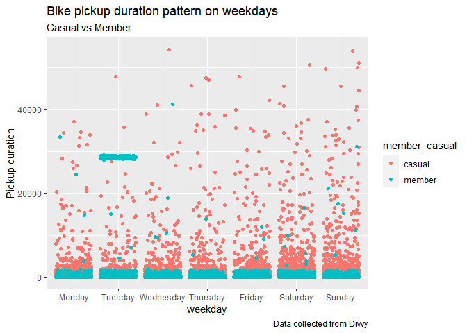
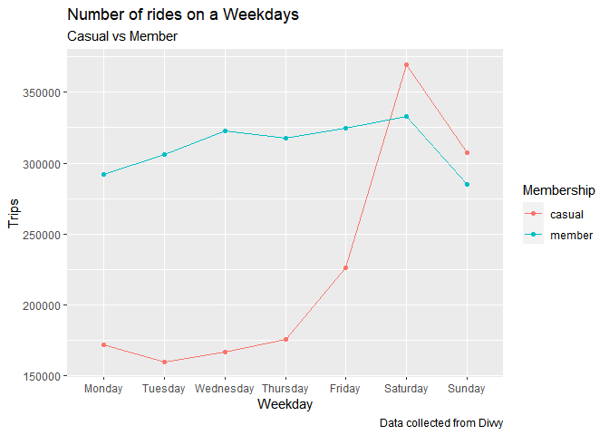
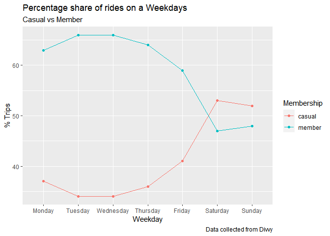
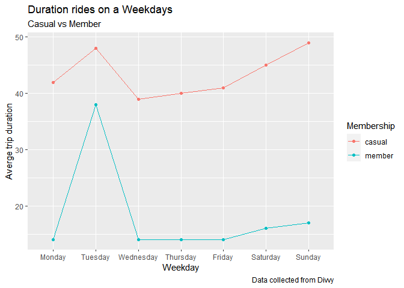
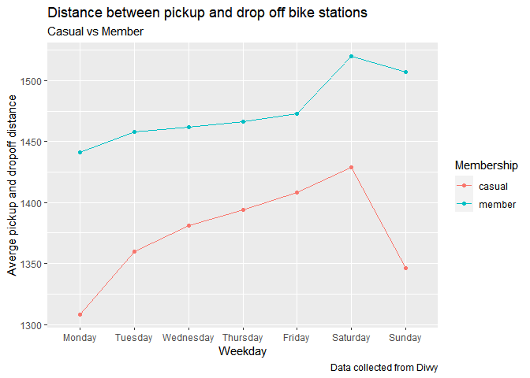
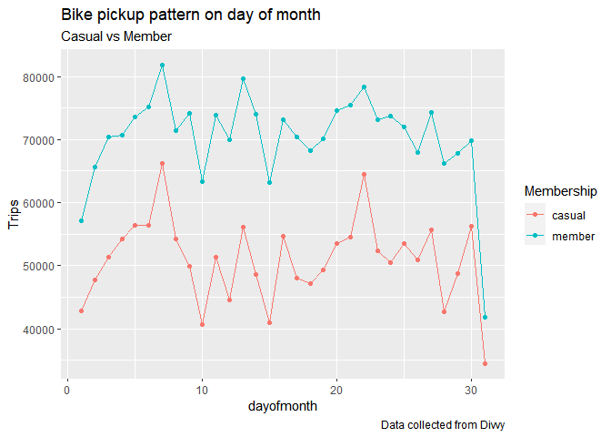
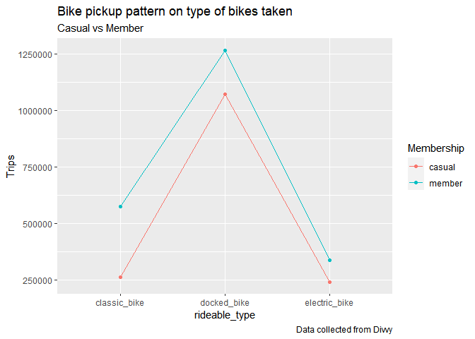
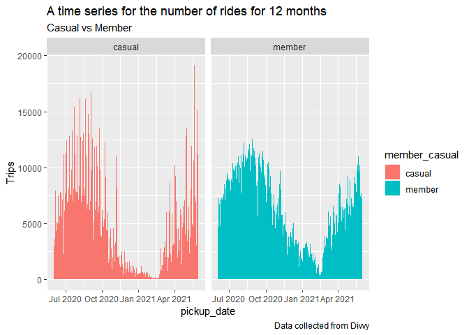
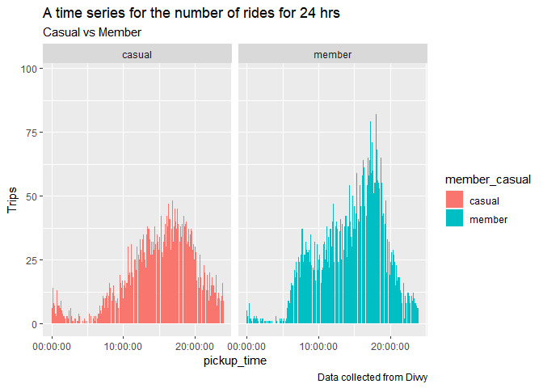

----

------------------------------------------------------------------------

### About DIVVY

In 2013, DIVVY launched a successful bike-share offering. Since then,
the program has grown to a fleet of 5,824 bicycles that are geo-tracked
and locked into a network of 692 stations across Chicago. The bikes can
be unlocked from one station and returned to any other station in the
system anytime.

### DIVVY bikeshare marketing program

Until now, DIVVY’s marketing strategy relied on building general
awareness and appealing to broad consumer segments. One approach that
helped make these things possible was the flexibility of its pricing
plans: single-ride passes, full-day passes, and annual memberships.
Customers who purchase single-ride or full-day passes are referred to as
casual riders. Customers who purchase annual memberships are DIVVY
members. DIVVY’s finance analysts have concluded that annual members are
much more profitable than casual riders. Although the pricing
flexibility helps DIVVY attract more customers, marketing lead believes
that maximizing the number of annual members will be key to future
growth. Rather than creating a marketing campaign that targets all-new
customers, he believes there is a very good chance to convert casual
riders into members. He notes that casual riders are already aware of
the DIVVY program and have chosen DIVVY for their mobility needs.

### We are interested in

How do annual members and casual riders use Divvy bikes differently?

### Data

We will use DIVVY’s historical trip data to analyze and identify trends.
Available at - <https://divvy-tripdata.s3.amazonaws.com/index.html>

For the purposes of this case study, the datasets are appropriate and
will enable you to answer the business questions. The data has been made
available by Motivate International Inc. under this license.) This is
public data that you can use to explore how different customer types are
using DIVVY bikes. But note that data-privacy issues prohibit you from
using riders’ personally identifiable information. This means that you
won’t be able to connect pass purchases to credit card numbers to
determine if casual riders live in the DIVVY service area or if they
have purchased multiple single passes.

### Data collection

The above data repository has different CSV files, we will pull the
required data for our study. Here are the different CSV files and their
details.

-   **yyyymm-divvy-tripdata.csv** –each such file is holding 1 month of
    ride share data ( *from 04/2020 – 05/2021 , there are 14 files* as
    of today). The fields in the data table are very much
    self-explanatory ( ride_id, rideable_type, started_at, ended_at,
    start_station_name, start_station_id, end_station_name,
    end_station_id, start_lat, start_lng, end_lat, end_lng,
    member_casual) we will use 12 files which is one complete year.

-   **Divvy_Trips_yyyy_Qx.csv**- such files containing more details
    about trip ( trip_id, starttime, stoptime, bikeid, tripduration,
    from_station_id, from_station_name, to_station_id, to_station_name,
    usertype, gender, birthyear) data (*from 2013 up to Q1 2020*)– We
    will not use this data because of 2 main reasons. First, these files
    are having redundant and old information, previous group was having
    latest files. Secondly, these files are having some of the
    demographics information about the tripper which is useful but that
    data is only collected for the members so it will not be helpful for
    comparative analysis. So, we will not use it.

-   **Divvy_Stations_yyyy-QxQx.xls**- These files containing the
    information about the bike stations (id, name, latitude, longitude,
    dpcapacity, online date) This information is not latest either so we
    may not be able to use it.

### Strategies to handle NULL value

Before doing any operation on data I have checked the data has may
missing values.

1.  End station details missing ( ID, name , lat, long) - It is not easy
    to fill the values for end station ( ID, name , lat, long) but if we
    assume the bikes were returned at the same station after the trip
    for these cases we can fill those values.

2.  Start station details missing ( ID, name ) - In the case of start
    station we do not have the lat, long missing for any record. so it
    is better if we can fill the station name and id from a master list
    of station.

There are many solutions, dropping the data is not easy decision, this
may skew the analysis.We will take this decision after  
\* Easy solution- just remove the rows with null values and move on, in
that case we may loose some important records which should be recorded.
\* Wise solution- Another approach could be to analyse each column and
missing fields, use some logic and assumptions to fill those. For this
let’s first develop a simple data frame (Bike_Stations) which contain
Station ID, Station Name and lat, long from the trip data. and use this
information to fill absolute or approx station details. After analyzing
the missing value records we can see the lat long are captured in 2 or 3
decimal digits. We do not know how these values are truncated / rounded
so we use iterative approach to find out the approximate values of start
stations. We will include lat long values for 3, 2, and 1 decimal places
and try to fill values using one after the other.

Due to interest of the time and question we are trying to solve, let’s
choose the Easy solution for handling the null values from the data.
Later we may try filling missing values with other solution also.

### Data pre-processing steps

Following steps needs to be performed on the unzipped 12 months of data
downloaded in the form of csv files (file naming would be
*yyyymm-divvy-tripdata.csv*)

<div class="figure">


<p class="caption">
Steps taken for analysis
</p>

</div>

#### Step 0 (Manual)-

Download and unzip the trip data files in a folder in my case I have
placed it in “02_Data/DataRaw” folder under my working directory.

#### Step 1 (Using R)-

Here we need to pre-process the CSV files.

1.  Remove NA records as mentioned above.

2.  Include new columns for Weekday, Month, Dayof month, Pickup date,
    pickup time, ride duration,ride distance.

3.  Drop some of the columns ride_id, end_station_id, start_station_id

4.  Write the CSV files in “02_Data/Preprocessed_1” folder

<!-- -->

    ## -- Attaching packages --------------------------------------- tidyverse 1.3.1 --

    ## v ggplot2 3.3.4     v purrr   0.3.4
    ## v tibble  3.1.2     v dplyr   1.0.6
    ## v tidyr   1.1.3     v stringr 1.4.0
    ## v readr   1.4.0     v forcats 0.5.1

    ## -- Conflicts ------------------------------------------ tidyverse_conflicts() --
    ## x dplyr::filter() masks stats::filter()
    ## x dplyr::lag()    masks stats::lag()

    ## 
    ## Attaching package: 'psych'

    ## The following objects are masked from 'package:ggplot2':
    ## 
    ##     %+%, alpha

    ## 
    ## Attaching package: 'lubridate'

    ## The following objects are masked from 'package:base':
    ## 
    ##     date, intersect, setdiff, union

``` r
# Set the data directory path 
## CHANGE ME ##
setwd("D:/MyDataProjects/Divvy_bikesharing")
datafolder = "02_Data/DataRaw"
###############
# 
# 
# processedfolder = "02_Data/Preprocessed_1"
# processedfolder2 = "02_Data/Preprocessed_2"
# file_names = list.files(datafolder,pattern = "*.csv")
# bikedfs <- list()
# cl_bikedfs<- list()
# for ( i in seq_along(file_names)){
#   bikedfs[[i]] <- read_csv(file.path(datafolder,file_names[i]))
# 
#   colnames(bikedfs[[i]])
#   colSums(is.na(bikedfs[[i]]))
# 
#   cl_bikedfs[[i]] <- drop_na(bikedfs[[i]])
#   colSums(is.na(cl_bikedfs[[i]]))
# 
#   cl_bikedfs[[i]] <- cl_bikedfs[[i]] %>%
#     mutate(Weekday = weekdays(as.Date(started_at)))
# 
#   cl_bikedfs[[i]] <- cl_bikedfs[[i]] %>%
#     mutate(month = months(as.Date(started_at)))
# 
#   cl_bikedfs[[i]] <- cl_bikedfs[[i]] %>%
#     mutate(dayofmonth = day(as.Date(started_at)))
# 
#   cl_bikedfs[[i]] <- cl_bikedfs[[i]] %>%
#     mutate(pickup_date = as.Date(started_at))
# 
#   cl_bikedfs[[i]] <- cl_bikedfs[[i]] %>%
#     mutate(pickup_time = format(started_at, format = "%H:%M:%S"))
# 
#   intv <- interval(cl_bikedfs[[i]]$started_at, cl_bikedfs[[i]]$ended_at)
# 
#   cl_bikedfs[[i]] <- cl_bikedfs[[i]] %>%
#     mutate(ride_duration = trunc(time_length(intv, "minutes")))
# 
#   cl_bikedfs[[i]] <- cl_bikedfs[[i]] %>%
#     mutate(ride_distance = as.integer(distHaversine(cl_bikedfs[[i]][,9:10], cl_bikedfs[[i]][,11:12])))
# 
#   cl_bikedfs[[i]] <- cl_bikedfs[[i]] %>%
#     select(-ride_id, -end_station_id,-start_station_id)
# 
#   write_csv(cl_bikedfs[[i]], file.path(processedfolder,paste ("cl_",file_names[[i]])), append=FALSE)
# 
#   #cl_bike_master <- rbind(cl_bike_master,cl_bikedfs[[i]])
#   # write.xlsx(
#   #   cl_bikedfs[[i]],
#   #   file =  file.path(processedfolder,paste (trimws(paste("cl_",file_names[[i]])),".xlsx")),
#   #   colNames = TRUE, overwrite =TRUE
#   # )
# }
```

#### Step 2 (Using SQL)-

Now it’s up-to us if we would like to combine the files here in a master
CSV file containing all data records or we would like to use SQL to hold
the back-end data. I choose SQL because combined CSV file is very bulky
and MS excel was unable to open it completely. In that case I may not be
able to do initial analysis on excel without full data.

Here is the SQL script which can be used to generate tables and push the
data into those.

``` sql
DROP TABLE IF EXISTS "biketrip";


CREATE TABLE "biketrip" (rideable_type varchar, 
  started_at TIMESTAMP,
  ended_at TIMESTAMP,
  start_station_name varchar, 
  end_station_name varchar, 
  start_lat DOUBLE PRECISION, 
  start_lng DOUBLE PRECISION, 
  end_lat DOUBLE PRECISION, 
  end_lng DOUBLE PRECISION, 
  member_casual varchar, 
  Weekday varchar, 
  MONTH varchar, 
  dayofmonth int, 
  pickup_date Date, 
  pickup_time TIME,
  ride_duration int, ride_distance int
);

COPY "biketrip"(rideable_type,
                started_at,
                ended_at,
                start_station_name,
                end_station_name,
                start_lat,
                start_lng,
                end_lat,
                end_lng,
                member_casual,
                Weekday,
                MONTH,
                dayofmonth,
                pickup_date,
                pickup_time,
                ride_duration,
                ride_distance)
FROM 'D:\MyDataProjects\Divvy_bikesharing\02_Data\Preprocessed_1\cl_ 202006-divvy-tripdata.csv'
DELIMITER ',' CSV HEADER;

COPY "biketrip"(rideable_type,
                started_at,
                ended_at,
                start_station_name,
                end_station_name,
                start_lat,
                start_lng,
                end_lat,
                end_lng,
                member_casual,
                Weekday,
                MONTH,
                dayofmonth,
                pickup_date,
                pickup_time,
                ride_duration,
                ride_distance)
FROM 'D:\MyDataProjects\Divvy_bikesharing\02_Data\Preprocessed_1\cl_ 202007-divvy-tripdata.csv'
DELIMITER ',' CSV HEADER;

COPY "biketrip"(rideable_type,
                started_at,
                ended_at,
                start_station_name,
                end_station_name,
                start_lat,
                start_lng,
                end_lat,
                end_lng,
                member_casual,
                Weekday,
                MONTH,
                dayofmonth,
                pickup_date,
                pickup_time,
                ride_duration,
                ride_distance)
FROM 'D:\MyDataProjects\Divvy_bikesharing\02_Data\Preprocessed_1\cl_ 202008-divvy-tripdata.csv'
DELIMITER ',' CSV HEADER;

COPY "biketrip"(rideable_type,
                started_at,
                ended_at,
                start_station_name,
                end_station_name,
                start_lat,
                start_lng,
                end_lat,
                end_lng,
                member_casual,
                Weekday,
                MONTH,
                dayofmonth,
                pickup_date,
                pickup_time,
                ride_duration,
                ride_distance)
FROM 'D:\MyDataProjects\Divvy_bikesharing\02_Data\Preprocessed_1\cl_ 202009-divvy-tripdata.csv'
DELIMITER ',' CSV HEADER;

COPY "biketrip"(rideable_type,
                started_at,
                ended_at,
                start_station_name,
                end_station_name,
                start_lat,
                start_lng,
                end_lat,
                end_lng,
                member_casual,
                Weekday,
                MONTH,
                dayofmonth,
                pickup_date,
                pickup_time,
                ride_duration,
                ride_distance)
FROM 'D:\MyDataProjects\Divvy_bikesharing\02_Data\Preprocessed_1\cl_ 202010-divvy-tripdata.csv'
DELIMITER ',' CSV HEADER;

COPY "biketrip"(rideable_type,
                started_at,
                ended_at,
                start_station_name,
                end_station_name,
                start_lat,
                start_lng,
                end_lat,
                end_lng,
                member_casual,
                Weekday,
                MONTH,
                dayofmonth,
                pickup_date,
                pickup_time,
                ride_duration,
                ride_distance)
FROM 'D:\MyDataProjects\Divvy_bikesharing\02_Data\Preprocessed_1\cl_ 202011-divvy-tripdata.csv'
DELIMITER ',' CSV HEADER;

COPY "biketrip"(rideable_type,
                started_at,
                ended_at,
                start_station_name,
                end_station_name,
                start_lat,
                start_lng,
                end_lat,
                end_lng,
                member_casual,
                Weekday,
                MONTH,
                dayofmonth,
                pickup_date,
                pickup_time,
                ride_duration,
                ride_distance)
FROM 'D:\MyDataProjects\Divvy_bikesharing\02_Data\Preprocessed_1\cl_ 202012-divvy-tripdata.csv'
DELIMITER ',' CSV HEADER;

COPY "biketrip"(rideable_type,
                started_at,
                ended_at,
                start_station_name,
                end_station_name,
                start_lat,
                start_lng,
                end_lat,
                end_lng,
                member_casual,
                Weekday,
                MONTH,
                dayofmonth,
                pickup_date,
                pickup_time,
                ride_duration,
                ride_distance)
FROM 'D:\MyDataProjects\Divvy_bikesharing\02_Data\Preprocessed_1\cl_ 202101-divvy-tripdata.csv'
DELIMITER ',' CSV HEADER;

COPY "biketrip"(rideable_type,
                started_at,
                ended_at,
                start_station_name,
                end_station_name,
                start_lat,
                start_lng,
                end_lat,
                end_lng,
                member_casual,
                Weekday,
                MONTH,
                dayofmonth,
                pickup_date,
                pickup_time,
                ride_duration,
                ride_distance)
FROM 'D:\MyDataProjects\Divvy_bikesharing\02_Data\Preprocessed_1\cl_ 202102-divvy-tripdata.csv'
DELIMITER ',' CSV HEADER;

COPY "biketrip"(rideable_type,
                started_at,
                ended_at,
                start_station_name,
                end_station_name,
                start_lat,
                start_lng,
                end_lat,
                end_lng,
                member_casual,
                Weekday,
                MONTH,
                dayofmonth,
                pickup_date,
                pickup_time,
                ride_duration,
                ride_distance)
FROM 'D:\MyDataProjects\Divvy_bikesharing\02_Data\Preprocessed_1\cl_ 202103-divvy-tripdata.csv'
DELIMITER ',' CSV HEADER;

COPY "biketrip"(rideable_type,
                started_at,
                ended_at,
                start_station_name,
                end_station_name,
                start_lat,
                start_lng,
                end_lat,
                end_lng,
                member_casual,
                Weekday,
                MONTH,
                dayofmonth,
                pickup_date,
                pickup_time,
                ride_duration,
                ride_distance)
FROM 'D:\MyDataProjects\Divvy_bikesharing\02_Data\Preprocessed_1\cl_ 202104-divvy-tripdata.csv'
DELIMITER ',' CSV HEADER;

COPY "biketrip"(rideable_type,
                started_at,
                ended_at,
                start_station_name,
                end_station_name,
                start_lat,
                start_lng,
                end_lat,
                end_lng,
                member_casual,
                Weekday,
                MONTH,
                dayofmonth,
                pickup_date,
                pickup_time,
                ride_duration,
                ride_distance)
FROM 'D:\MyDataProjects\Divvy_bikesharing\02_Data\Preprocessed_1\cl_ 202105-divvy-tripdata.csv'
DELIMITER ',' CSV HEADER;
```

#### Step 3 (Using R)-

Creating the connection with postgres SQL server locally loaded, life
will be easy once you get connection created successfully. We can do
analysis on the stored data, there is no limit now.

    ## Loading required package: DBI

Very first query checking what we have

``` r
all_trips <- dbGetQuery(con, 'SELECT * FROM "biketrip"  ')

glimpse(all_trips)
```

    ## Rows: 3,759,262
    ## Columns: 17
    ## $ rideable_type      <chr> "docked_bike", "docked_bike", "docked_bike", "docke~
    ## $ started_at         <dttm> 2020-06-13 23:24:48, 2020-06-26 07:26:10, 2020-06-~
    ## $ ended_at           <dttm> 2020-06-13 23:36:55, 2020-06-26 07:31:58, 2020-06-~
    ## $ start_station_name <chr> "Wilton Ave & Belmont Ave", "Federal St & Polk St",~
    ## $ end_station_name   <chr> "Damen Ave & Clybourn Ave", "Daley Center Plaza", "~
    ## $ start_lat          <dbl> 41.94018, 41.87208, 41.88424, 41.94553, 41.92154, 4~
    ## $ start_lng          <dbl> -87.65304, -87.62954, -87.62963, -87.64644, -87.653~
    ## $ end_lat            <dbl> 41.93193, 41.88424, 41.87405, 41.97835, 41.94018, 4~
    ## $ end_lng            <dbl> -87.67786, -87.62963, -87.62772, -87.65975, -87.653~
    ## $ member_casual      <chr> "casual", "member", "member", "casual", "casual", "~
    ## $ weekday            <chr> "Saturday", "Friday", "Tuesday", "Saturday", "Thurs~
    ## $ month              <chr> "June", "June", "June", "June", "June", "June", "Ju~
    ## $ dayofmonth         <int> 13, 26, 23, 20, 25, 17, 25, 19, 30, 28, 29, 13, 6, ~
    ## $ pickup_date        <date> 2020-06-13, 2020-06-26, 2020-06-23, 2020-06-20, 20~
    ## $ pickup_time        <time> 23:24:48, 07:26:10, 17:12:41, 01:09:35, 16:59:25, ~
    ## $ ride_duration      <int> 12, 5, 8, 18, 9, 10, 6, 8, 21, 10, 20, 18, 45, 13, ~
    ## $ ride_distance      <int> 2762, 56, 218, 1489, 121, 121, 56, 694, 1796, 1560,~

``` r
str(all_trips)
```

    ## 'data.frame':    3759262 obs. of  17 variables:
    ##  $ rideable_type     : chr  "docked_bike" "docked_bike" "docked_bike" "docked_bike" ...
    ##  $ started_at        : POSIXct, format: "2020-06-13 23:24:48" "2020-06-26 07:26:10" ...
    ##  $ ended_at          : POSIXct, format: "2020-06-13 23:36:55" "2020-06-26 07:31:58" ...
    ##  $ start_station_name: chr  "Wilton Ave & Belmont Ave" "Federal St & Polk St" "Daley Center Plaza" "Broadway & Cornelia Ave" ...
    ##  $ end_station_name  : chr  "Damen Ave & Clybourn Ave" "Daley Center Plaza" "State St & Harrison St" "Broadway & Berwyn Ave" ...
    ##  $ start_lat         : num  41.9 41.9 41.9 41.9 41.9 ...
    ##  $ start_lng         : num  -87.7 -87.6 -87.6 -87.6 -87.7 ...
    ##  $ end_lat           : num  41.9 41.9 41.9 42 41.9 ...
    ##  $ end_lng           : num  -87.7 -87.6 -87.6 -87.7 -87.7 ...
    ##  $ member_casual     : chr  "casual" "member" "member" "casual" ...
    ##  $ weekday           : chr  "Saturday" "Friday" "Tuesday" "Saturday" ...
    ##  $ month             : chr  "June" "June" "June" "June" ...
    ##  $ dayofmonth        : int  13 26 23 20 25 17 25 19 30 28 ...
    ##  $ pickup_date       : Date, format: "2020-06-13" "2020-06-26" ...
    ##  $ pickup_time       : 'hms' num  23:24:48 07:26:10 17:12:41 01:09:35 ...
    ##   ..- attr(*, "units")= chr "secs"
    ##  $ ride_duration     : int  12 5 8 18 9 10 6 8 21 10 ...
    ##  $ ride_distance     : int  2762 56 218 1489 121 121 56 694 1796 1560 ...

``` r
summary(all_trips)
```

    ##  rideable_type        started_at                     ended_at                  
    ##  Length:3759262     Min.   :2020-06-03 05:59:59   Min.   :2020-06-03 06:03:37  
    ##  Class :character   1st Qu.:2020-08-03 17:04:43   1st Qu.:2020-08-03 17:27:52  
    ##  Mode  :character   Median :2020-09-23 18:23:39   Median :2020-09-23 18:44:27  
    ##                     Mean   :2020-11-02 07:08:28   Mean   :2020-11-02 07:33:06  
    ##                     3rd Qu.:2021-03-04 20:15:30   3rd Qu.:2021-03-04 20:26:50  
    ##                     Max.   :2021-05-31 23:59:16   Max.   :2021-06-10 22:17:11  
    ##  start_station_name end_station_name     start_lat       start_lng     
    ##  Length:3759262     Length:3759262     Min.   :41.65   Min.   :-87.77  
    ##  Class :character   Class :character   1st Qu.:41.88   1st Qu.:-87.66  
    ##  Mode  :character   Mode  :character   Median :41.90   Median :-87.64  
    ##                                        Mean   :41.90   Mean   :-87.64  
    ##                                        3rd Qu.:41.93   3rd Qu.:-87.63  
    ##                                        Max.   :42.06   Max.   :-87.53  
    ##     end_lat         end_lng       member_casual        weekday         
    ##  Min.   :41.65   Min.   :-87.77   Length:3759262     Length:3759262    
    ##  1st Qu.:41.88   1st Qu.:-87.66   Class :character   Class :character  
    ##  Median :41.90   Median :-87.64   Mode  :character   Mode  :character  
    ##  Mean   :41.90   Mean   :-87.64                                        
    ##  3rd Qu.:41.93   3rd Qu.:-87.63                                        
    ##  Max.   :42.07   Max.   :-87.52                                        
    ##     month             dayofmonth     pickup_date         pickup_time      
    ##  Length:3759262     Min.   : 1.00   Min.   :2020-06-03   Length:3759262   
    ##  Class :character   1st Qu.: 8.00   1st Qu.:2020-08-03   Class1:hms       
    ##  Mode  :character   Median :16.00   Median :2020-09-23   Class2:difftime  
    ##                     Mean   :15.87   Mean   :2020-11-01   Mode  :numeric   
    ##                     3rd Qu.:23.00   3rd Qu.:2021-03-04                    
    ##                     Max.   :31.00   Max.   :2021-05-31                    
    ##  ride_duration       ride_distance  
    ##  Min.   :-29049.00   Min.   :    0  
    ##  1st Qu.:     7.00   1st Qu.:  337  
    ##  Median :    14.00   Median : 1014  
    ##  Mean   :    24.15   Mean   : 1436  
    ##  3rd Qu.:    26.00   3rd Qu.: 2045  
    ##  Max.   : 54283.00   Max.   :20037

``` r
describe(all_trips)
```

    ## Warning in FUN(newX[, i], ...): no non-missing arguments to min; returning Inf

    ## Warning in FUN(newX[, i], ...): no non-missing arguments to min; returning Inf

    ## Warning in FUN(newX[, i], ...): no non-missing arguments to min; returning Inf

    ## Warning in FUN(newX[, i], ...): no non-missing arguments to min; returning Inf

    ## Warning in FUN(newX[, i], ...): no non-missing arguments to min; returning Inf

    ## Warning in FUN(newX[, i], ...): no non-missing arguments to min; returning Inf

    ## Warning in FUN(newX[, i], ...): no non-missing arguments to min; returning Inf

    ## Warning in FUN(newX[, i], ...): no non-missing arguments to min; returning Inf

    ## Warning in FUN(newX[, i], ...): no non-missing arguments to min; returning Inf

    ## Warning in FUN(newX[, i], ...): no non-missing arguments to min; returning Inf

    ## Warning in FUN(newX[, i], ...): no non-missing arguments to max; returning -Inf

    ## Warning in FUN(newX[, i], ...): no non-missing arguments to max; returning -Inf

    ## Warning in FUN(newX[, i], ...): no non-missing arguments to max; returning -Inf

    ## Warning in FUN(newX[, i], ...): no non-missing arguments to max; returning -Inf

    ## Warning in FUN(newX[, i], ...): no non-missing arguments to max; returning -Inf

    ## Warning in FUN(newX[, i], ...): no non-missing arguments to max; returning -Inf

    ## Warning in FUN(newX[, i], ...): no non-missing arguments to max; returning -Inf

    ## Warning in FUN(newX[, i], ...): no non-missing arguments to max; returning -Inf

    ## Warning in FUN(newX[, i], ...): no non-missing arguments to max; returning -Inf

    ## Warning in FUN(newX[, i], ...): no non-missing arguments to max; returning -Inf

    ##                    vars       n    mean      sd       min      max    range
    ## rideable_type         1 3759262     NaN      NA       Inf     -Inf     -Inf
    ## started_at            2 3759262     NaN      NA       Inf     -Inf     -Inf
    ## ended_at              3 3759262     NaN      NA       Inf     -Inf     -Inf
    ## start_station_name    4 3759262     NaN      NA       Inf     -Inf     -Inf
    ## end_station_name      5 3759262     NaN      NA       Inf     -Inf     -Inf
    ## start_lat             6 3759262   41.90    0.04     41.65    42.06     0.42
    ## start_lng             7 3759262  -87.64    0.02    -87.77   -87.53     0.25
    ## end_lat               8 3759262   41.90    0.04     41.65    42.07     0.42
    ## end_lng               9 3759262  -87.64    0.02    -87.77   -87.52     0.25
    ## member_casual        10 3759262     NaN      NA       Inf     -Inf     -Inf
    ## weekday              11 3759262     NaN      NA       Inf     -Inf     -Inf
    ## month                12 3759262     NaN      NA       Inf     -Inf     -Inf
    ## dayofmonth           13 3759262   15.87    8.78      1.00    31.00    30.00
    ## pickup_date          14 3759262     NaN      NA       Inf     -Inf     -Inf
    ## pickup_time          15 3759262     NaN      NA       Inf     -Inf     -Inf
    ## ride_duration        16 3759262   24.15  358.56 -29049.00 54283.00 83332.00
    ## ride_distance        17 3759262 1435.68 1503.12      0.00 20037.00 20037.00
    ##                      se
    ## rideable_type        NA
    ## started_at           NA
    ## ended_at             NA
    ## start_station_name   NA
    ## end_station_name     NA
    ## start_lat          0.00
    ## start_lng          0.00
    ## end_lat            0.00
    ## end_lng            0.00
    ## member_casual        NA
    ## weekday              NA
    ## month                NA
    ## dayofmonth         0.00
    ## pickup_date          NA
    ## pickup_time          NA
    ## ride_duration      0.18
    ## ride_distance      0.78

``` r
colSums(is.na(all_trips))
```

    ##      rideable_type         started_at           ended_at start_station_name 
    ##                  0                  0                  0                  0 
    ##   end_station_name          start_lat          start_lng            end_lat 
    ##                  0                  0                  0                  0 
    ##            end_lng      member_casual            weekday              month 
    ##                  0                  0                  0                  0 
    ##         dayofmonth        pickup_date        pickup_time      ride_duration 
    ##                  0                  0                  0                  0 
    ##      ride_distance 
    ##                  0

``` r
counts <- aggregate(all_trips$ride_duration ~ all_trips$member_casual + all_trips$weekday, FUN = mean)

print(counts)
```

    ##    all_trips$member_casual all_trips$weekday all_trips$ride_duration
    ## 1                   casual            Friday                40.66118
    ## 2                   member            Friday                14.36478
    ## 3                   casual            Monday                42.38123
    ## 4                   member            Monday                14.06665
    ## 5                   casual          Saturday                44.49962
    ## 6                   member          Saturday                16.28879
    ## 7                   casual            Sunday                49.03258
    ## 8                   member            Sunday                16.79669
    ## 9                   casual          Thursday                40.24589
    ## 10                  member          Thursday                13.89595
    ## 11                  casual           Tuesday                28.05872
    ## 12                  member           Tuesday               -10.34339
    ## 13                  casual         Wednesday                38.57492
    ## 14                  member         Wednesday                13.99783

Let’s perform some analysis by visualization using ggplot2

``` r
all_trips$weekday <- ordered(all_trips$weekday, levels=c("Monday", "Tuesday", "Wednesday", "Thursday", "Friday", "Saturday","Sunday" ))

all_trips %>%
  arrange(member_casual, weekday) %>% 
ggplot(aes(x=weekday , y=as.integer(abs(ride_duration)), group =member_casual, colour = member_casual)) + 
  geom_jitter()+
  ylab("Pickup duration")+
  labs(title = "Bike pickup duration pattern on weekdays", subtitle = "Casual vs Member", 
       caption = "Data collected from Divvy")
```



In the above plot it is clear that casual customers are using bikes for
longer terms once they pick it, only Tuesday we see some members
cluttered at a specie time that need to be investigated.

``` r
dm <- dbGetQuery(con, 'SELECT  weekday as "Weekday", member_casual as "Membership", COUNT(*) as Trips,  
CAST((COUNT(*) / CAST( SUM(count(*)) over (partition by Weekday) as float))*100 as INTEGER ) as trip_percent

FROM "biketrip" GROUP BY "weekday", "member_casual" ')


dm$Weekday <- ordered(dm$Weekday, levels=c("Monday", "Tuesday", "Wednesday", "Thursday", "Friday", "Saturday","Sunday" ))

dm %>%
arrange(Membership, Weekday) %>% 
ggplot( aes(x= Weekday, y=as.integer(trips), group =Membership, colour = Membership)) + 
  geom_point() +
  geom_line() +
  ylab("Trips")+
  labs(title = "Number of rides on a Weekdays", subtitle = "Casual vs Member", 
       caption = "Data collected from Divvy")
```



Number of rides taken by members are constant except weekend we see a
dip here, on the other hand casual customers are more enthusiastic as
weekend in approaching they even use bikes more then regular members.

``` r
dm %>%
  arrange(Membership, Weekday) %>% 
ggplot(aes(x= Weekday, y=as.integer(trip_percent), group =Membership, colour = Membership)) + 
  geom_point() +
  geom_line() +
  ylab("% Trips")+
  labs(title = "Percentage share of rides on a Weekdays", subtitle = "Casual vs Member", 
       caption = "Data collected from Divvy")
```



Percentage share of trips by both segment of customers shows different
pattern on weenday and weekend.

``` r
dm2 <- dbGetQuery(con, 'SELECT  weekday as "Weekday", member_casual as "Membership", CAST(AVG(ABS(ride_duration)) as INTEGER) as "duration"
FROM "biketrip" GROUP BY "weekday", "member_casual" ')
dm2$Weekday <- ordered(dm2$Weekday, levels=c("Monday", "Tuesday", "Wednesday", "Thursday", "Friday", "Saturday","Sunday" ))

dm2 %>%
  arrange(Membership, Weekday) %>% 
  ggplot(aes(x= Weekday, y=duration, group =Membership, colour = Membership)) + 
    geom_point() +
    geom_line() +
    ylab("Averge trip duration")+
    labs(title = "Duration rides on a Weekdays", subtitle = "Casual vs Member", 
       caption = "Data collected from Divvy")
```



Duration of bike pick up is always high in case of casual customers,
although Tuesday is most busiest weekday for both and weekends are
favorite for casual customers.

``` r
dm3 <- dbGetQuery(con, 'SELECT  weekday as "Weekday", member_casual as "Membership", CAST(AVG(ABS(ride_distance)) as INTEGER) as "Distance"
FROM "biketrip" GROUP BY "weekday", "member_casual" ')
dm3$Weekday <- ordered(dm3$Weekday, levels=c("Monday", "Tuesday", "Wednesday", "Thursday", "Friday", "Saturday","Sunday" ))

dm3 %>%
  arrange(Membership, Weekday) %>% 

ggplot( aes(x= Weekday, y=Distance, group =Membership, colour = Membership)) + 
  geom_point() +
  geom_line() +
  ylab("Averge pickup and dropoff distance")+
  labs(title = "Distance between pickup and drop off bike stations", subtitle = "Casual vs Member", 
       caption = "Data collected from Divvy")
```



Although the ride time is very high in case of casual customers but we
are seeing that they are returning the bike at the nearest point from
they have picked. The pattern is same for both.

``` r
dm4 <- dbGetQuery(con, 'SELECT  dayofmonth, member_casual as "Membership", COUNT(*) as Trips
FROM "biketrip" GROUP BY dayofmonth, "member_casual" ')

dm4 %>%
ggplot(aes(x= dayofmonth, y=as.integer(trips), group =Membership, colour = Membership)) + 
  geom_point() +
  geom_line() +
  ylab("Trips")+
  labs(title = "Bike pickup pattern on day of month", subtitle = "Casual vs Member", 
       caption = "Data collected from Divvy")
```



As per the above plot, pattern of bike pickup is same for both customers
through out the month.

``` r
dm5 <- dbGetQuery(con, 'SELECT  rideable_type, member_casual as "Membership", COUNT(*) as Trips
FROM "biketrip" GROUP BY rideable_type, "member_casual" ')

dm5 %>%
ggplot( aes(x= rideable_type, y=as.integer(trips), group =Membership, colour = Membership)) + 
  geom_point() +
  geom_line() +
  ylab("Trips")+
  labs(title = "Bike pickup pattern on type of bikes taken", subtitle = "Casual vs Member", 
       caption = "Data collected from Divvy")
```



As per above plot the docked bike is favorite for both customers.

``` r
all_trips %>% 
  ggplot(mapping = aes(x = pickup_date, fill = member_casual))+
  geom_bar()+
  ylab("Trips")+
  facet_grid(~member_casual)+
  labs(title = "A time series for the number of rides for 12 months", subtitle = "Casual vs Member", 
       caption = "Data collected from Divvy")
```



As we can see in Chicago summer is good time for outdoor sports, so
bikes are picked by casual customers quite often but winters are hard
and we see usage is quite low in this season.

``` r
all_trips %>% 
  ggplot(mapping = aes(x = pickup_time,  fill = member_casual))+
  geom_bar()+
  ylab("Trips")+
  facet_grid(~member_casual)+
  labs(title = "A time series for the number of rides for 24 hrs", subtitle = "Casual vs Member", 
       caption = "Data collected from Divvy")
```



As per the pattern of bike pick throughout the day we see members are
picking bikes for working hrs. Sudden dip after 6 PM shows those bikes
were used to commute from work. Where casual bikers are returning slowly
with a constant rate.

#### Step 4 (Tableau public)-

Initial viz available at

<https://public.tableau.com/app/profile/ng2530/viz/DIVVYRideshare/Sheet1>

### Summary

I will summarize here the behavioral differences between the members and
casual rider:

1.  Member rides take more trips daily.

2.  Casual riders use the service more on weekends while member riders
    take trips consistently throughout the week and low usage on
    weekends.

3.  Casual riders’ average trip duration more than doubled than that of
    members.

4.  Demand for service is at peak during summer season and then decline
    in the middle of fall season until it reaches at its lowest in
    winter season. This holds true for both riders.

5.  Despite showing the same pattern of demand throughout the year,
    changes in the average trip duration taken by each type differs.
    Casual riders’ usage fluctuates more than that of members.

6.  Casual riders drop the bike nearer to the pick up location. Although
    the patter is same.

### Solution

We would like to give following advice to the DIVVY’s marketing strategy
team.

1.  Launch campaign ads during spring and summer seasons specifically
    targeted for casual riders.

-   This can be advantageous since this is the time when the demand of
    bikes is highest. It can help increase the conversion rate.
-   Strategy is only applicable for certain months, not taking into
    account other seasons.

1.  Introduce a special offer where casual riders can avail for
    “weekend-only memberships”

-   This is an attractive offer since most casual riders use the service
    during weekends It is very customer-friendly and flexible. Can be
    offered at a lower price which may induce subscriptions.

-   This type of offer might face problems as it is a new plan.
    Constraints may be encountered regarding feasibility and
    profitability.

1.  The company can leverage with the long trip duration that casual
    users make by devising a customer loyalty program exclusive for
    those who subscribe to annual memberships. For example, users can
    earn points depending on the trip duration taken or if they reach a
    certain mile or an accumulated number of rides. The points will be
    convertible and can be used to grant users free rides or grant time
    extensions for bike usage.

2.  For casual users DIVVY can run a marketing program to educate them
    to drop bikes anywhere they want, they do not need to return it at
    the same place.

3.  Marketing team need to run some program to enroll commuters who are
    not using bikes for work, may be a family membership or group
    membership program would help.
